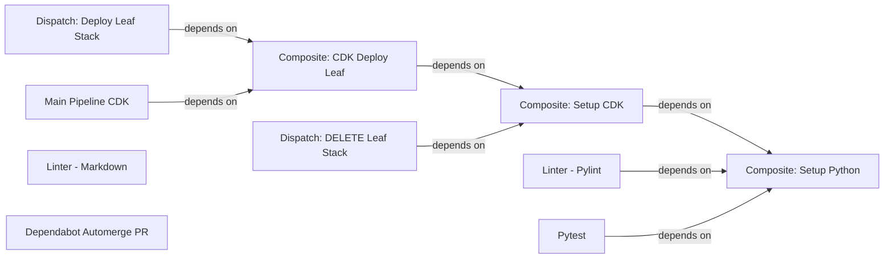

# GitHub Actions

**GitHub Actions Docs/References:**

- The GOOD docs on [writing workflows](https://docs.github.com/en/actions/writing-workflows/workflow-syntax-for-github-actions) that I can never find when I need.
- Docs on [context](https://docs.github.com/en/actions/writing-workflows/choosing-what-your-workflow-does/accessing-contextual-information-about-workflow-runs)'s (i.e ${{ github.* }}, and other built-in variables)

## Workflow Overview

### Summary of Actions

- #### [Main Pipeline CDK](./main-pipeline-cdk.yml) (./main-pipeline-cdk.yml)

    Mainly runs whenever a PR is merged. It'll deploy the base-stack first, then loop over each leaf-stack defined in [vars.DEPLOY_ENVIRONMENTS](#automating-a-new-leaf-stack-deployment) to deploy them one-by-one.

- #### [Dispatch: Deploy Leaf Stack](./dispatch-deploy-leaf-stack.yaml) (./dispatch-deploy-leaf-stack.yaml)

    Similar to [Main Pipeline CDK](#main-pipeline-cdk-main-pipeline-cdkyml), but it only deploys a single leaf-stack, and does NOT update the base-stack. Meant to be triggered manually whenever you need quick updates to a single leaf-stack.

- #### [Dispatch: DELETE Leaf Stack](./dispatch-delete-leaf-stack.yaml) (./dispatch-delete-leaf-stack.yaml)

    Similar to [Dispatch: Deploy Leaf Stack](#dispatch-deploy-leaf-stack-dispatch-deploy-leaf-stackyaml), but it DELETES the leaf-stack instead.

- #### [Dependabot Automerge PR](./dependabot-automerge-pr.yml) (./dependabot-automerge-pr.yml)

    See [Dependabot Auto-Updates](#dependabot-auto-updates) for details.

- #### [Pytest](./pytest.yaml) (./pytest.yaml)

    Runs all the unit tests in the repo. Also includes loading ALL `./Examples/*` configs, to make sure they never go out of date.

- #### All `composite-*` Actions

    Composite GH Actions are a way to re-use common steps across multiple workflows. This eliminates repeated code, and keeps it in manageable/readable chunks.

## Automating the `base-stack`

[Main Pipeline CDK](./main-pipeline-cdk.yml) will naturally do this. See [Forking this Repo](#forking-this-repo) for setting up the required secrets/variables (in the "root", NOT any GH environment).

## Automating a New `leaf-stack` Deployment

We keep deployments separate with using GitHub Environments. The `Name` of the environment has to match the [container-id](../../README.md#container-id) you'll want to use (so it'll be in the URL too).

For each separate environment, you'll have to also set:

- `vars.CONFIG_PATH`: The path to the config file inside this repo. (i.e `./Examples/Minecraft.java.example.yaml`)

In the "root" GitHub Variables (NOT the environment), you'll also want to update `DEPLOY_ENVIRONMENTS`. It's a **newline-separated** list of GH environment NAMES to deploy.

> [!NOTE]
> ALL Vars/Secrets will become environment variables inside the action. You can hide server secrets while deploying this way, by declaring them in the environment. This lets ONLY that deployment config have access to that secret, and not echo it out. It then can be used in the config file yaml with the `!ENV ${VAR_NAME}` syntax.

## Dependabot Auto-Updates

This repo auto-merges Dependabot PR's if all the required actions pass. This is done with the [Dependabot Automerge PR](./dependabot-automerge-pr.yml) workflow. Changes to support this include:

- Disabled PR code having to be up to date with base. If two dependabot PRs are open at the same time, the second one will fail to merge.
  - We can technically get around this by setting the max-pr to 1 in each config block, then having each block run a different day of the week. This feels really hacky though...
- Added [CODEOWNERS](../CODEOWNERS) file, but had to disable on the files dependabot touches. There's no way to add apps (`dependabot[bot]`) to CODEOWNERS. (More details in the CODEOWNERS file itself.).
- Added a list of required actions to Branch Protections Rules for `main`. When dependabot waits to auto-merge, it'll only wait for **required** actions to finish.
  - They also can't contain the `on.<trigger>.paths` key. If they do, and the paths isn't in the PR, you won't be able to merge it. (It just freezes saying "Expected — Waiting for status to be reported", but that trigger stops the action from running).
- In [dependabot.yml](../dependabot.yml), added a `groups` section. This makes all updates happen under a single PR. That way if 3 updates get created, you don't merge all 3 at the same time and try to do 3 deployment updates at once.
- EnvVars: All secrets/vars dependabot needs to run the test-suite, need to be declared in `Settings -> Secrets and Variables -> Dependabot`. It can't access the normal secrets/vars.

## Forking this Repo

I specifically designed all the automation, so that if it's forked, you can re-use it and customize it to your own needs without conflicting with the base. The way of doing this was relying on GitHub's secrets/variables when deploying.

1) Setup [AWS OIDC](https://docs.github.com/en/actions/security-for-github-actions/security-hardening-your-deployments/configuring-openid-connect-in-amazon-web-services). How I do it personally is at [Cameronsplaze/AWS-OIDC](https://github.com/Cameronsplaze/AWS-OIDC). It's only one-per-account, so it can't be in this repo.

2) There's a couple steps inside [Dependabot Auto-updates](#dependabot-auto-updates) above you'll want to follow, like setting up branch protections with required actions.

3) **Secrets and variables: Actions Secrets** you'll want declared (in the 'core', NOT in any environment):

    - **AWS_ACCOUNT_ID**: Your AWS Account ID.
    - **DOMAIN_NAME**: The domain name of your Route53 Hosted Zone.
    - **HOSTED_ZONE_ID**: The ID of your Route53 Hosted Zone.
    - **EMAILS**: A Space-Separated list of emails to notify alerts. It has to be a single value, so you can pass in any number without editing the config if needed. (The `composite-setup-cdk` action will add masks to each item inside the list automatically).

4) **Secrets and variables: *Actions Variables*** you'll want declared (in the 'core', NOT in any environment):

    - **AWS_DEPLOY_ROLE**: The role to use with OIDC. (If you're using my repo, it's `github_actions_role`).
    - **AWS_REGION**: The region to deploy to. (Some HAS to be deployed to `us-east-1`, this is everything else that's not restricted).
    - **DEPLOY_ENVIRONMENTS**: The list of container config paths to deploy, each on their own line. (See '[Automating a New Leaf Stack Deployment](#automating-a-new-leaf-stack-deployment)' for details).

5) **Secrets and variables: *Dependabot Secrets***: These are only accessible to dependabot, BUT dependabot can't access any of the github secrets above. This all will be duplicates of the above section.

    - **AWS_ACCOUNT_ID**: Your AWS Account ID.
    - **PAT_AUTOMERGE_PR**: A *classic* PAT with ONLY `repo:public_repo` permissions. (Has to be classic until [this issue](https://github.com/cli/cli/issues/9166) is fixed. You'll get permission denied otherwise.) Create this under `Account` -> `Settings` -> `Developer Settings` -> `Personal Access Tokens` -> `Tokens (classic)`

6) Follow '[Automating a New Leaf Stack Deployment](#automating-a-new-leaf-stack-deployment)' above for adding a new container to deploy. Can go through any number of times, once per server.
