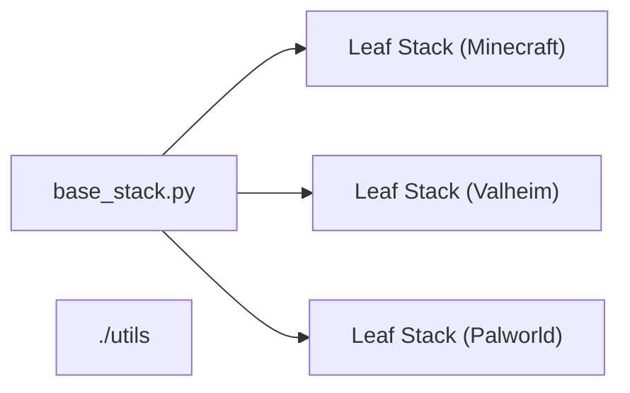

# Container Manager

## Editing the Base Stack Config

These are config options for when you deploy the base stack, to fine-tune it to your needs. Make sure to update the [../base-stack-config.yaml](../base-stack-config.yaml) file in the root of this repo as that's the file the config-loader will look for.

- `Vpc`: (dict)

  - `MaxAZs`: (Default: `1`, int)

    The number of AZ's (Availability Zones) to use in the VPC. Two means high-availability, BUT your EFS storage costs will double.

- `Domain`: (dict)

  - `Name`: (Required, str)
    The root domain name for all the leaf_stack's.

  - `HostedZoneId`: (Optional - kinda, str)
    The Route53 Hosted Zone ID for the domain of the domain name above. If not provided, it will be created. (Though you'll probably have to manually update the NS records in your registrar or something. I haven't tested this path yet. If you buy a AWS Domain, it'll come with a HostedZoneID anyways).

- `AlertSubscription`: (Optional, list)

  Any number of key-value pairs, where the key is the protocol (i.e "Email"), and the value is the endpoint (i.e "DoesNotExist@gmail.com")

    ```yaml
    AlertSubscription:
      - Email: DoesNotExist1@gmail.com
      - Email: DoesNotExist2@gmail.com
    ```

    Options like `SMS` and `HTTPS` I hope to add at some point, but `Email` was the easiest to just get off the ground.

    Only have someone subscribed to this, **OR** the leaf stack, **NOT BOTH**.

## How the Stack Works

This is designed so you only need one base stack that you deploy first, then you can deploy any number of leaf stacks on it. This lets you modify one leaf/container stack, without affecting the rest, and still have shared resources to reduce cost/complexity where appropriate.

### Quick Overview

Each of the links contain MUCH more detail on each component:

- The [base_stack.py](./base_stack.py) is common architecture that different containers can share (i.e VPC). Multiple "Leaf Stacks" can point to the same "Base Stack".
- The [./leaf_stack](./leaf_stack/README.md) is what runs a single container. One `leaf_stack` for one container.
- The [./utils](./utils/README.md) are functions that don't fit in the other two. Mainly config readers/parsers rn.



### Base Stack

The base stack is the common architecture that different containers can share. Most notably:

- **VPC**: The overall network for all the containers and EFS.
- **SSH Key Pair**: The key pair to SSH into the EC2 instances. Keeping it here lets you get into all the leaf_stacks without having to log into AWS each time you deploy a new leaf. If you destroy and re-build the leaf, this keeps the key consistent too.
- **SNS Notify Logic**: Designed for things admin would care about. This tells you whenever the instance spins up or down, if it runs into errors, etc.
- **Route53**: The base domain name for all stacks to build from.

### Leaf Stack

See the [leaf_stack README.md](./leaf_stack/README.md) for more info.  
