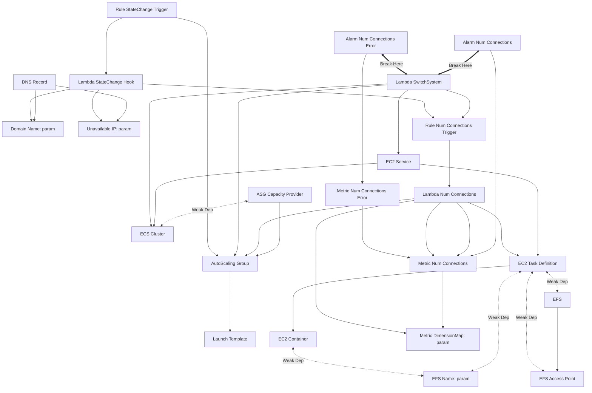

# How the Stack Works

TODO: Write this section.

I figured out the dependency graph up to this point, to help when I split pieces off into their own parts. (Each line says `A relies on B`.)

## Diagrams

- Mermaid Docs: <https://mermaid.js.org/syntax/flowchart.html>

- Put all EFS stuff in 1 stack
- Look at params, make anything they reference directly in a stack
  - I.e domain_name, unavailable_ip, and ttl are used in two places.
