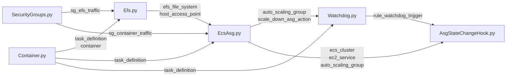

# Nested Stack Components

I broke out the core architecture into nested stacks, to keep each "chunk" easy to understand and manage. It was becoming a tangled mess of dependencies, and you'd have no idea what would create a circular import otherwise.

## Dependency Graph

## Components

### SecurityGroups

Factored this out to avoid circular imports. This NestedStack contains the security groups for the leaf_stack.

### Container

This creates the EC2 Task Definition and Container Definition for the stack.

### Efs

Elastic File System (EFS), is the persistent storage for the leaf_stack. This adds to the container definition, the ability to mount the EFS volume. Backups happen outside of the volume you mount as well, so if someone is able to hack your container somehow, they can't access the backups.

### EcsAsg

This creates the Ecs Cluster/Service, AutoScaling Group, and EC2 Launch Template for the ASG. This is basically the stack for managing the single EC2 instance itself. (ASG is used to simplify management, instead of juggling EC2 directly). It also needs the Efs component to mount it TO the instance itself. (It's also mounted to the container already). The reason is if it's mounted to the instance, you can use SFTP and other tools to access the data directly. No need to duplicate the data to S3 and pay extra costs for storage.

### Watchdog

This is the component for checking if anyone is connected to the container. It uses a Lambda function to run commands with SSM on the ec2 instance itself (and the commands run against the task on the instance). Once it detects no one is on for X many times, it scales down the ASG.

### AsgStateChangeHook

This component will trigger whenever the ASG instance state changes (i.e the one instance either spins up or down). This is used to keep the architecture simple, plus if you update the instance count in the console, everything will naturally update around it.
