# Leaf Stack - Container Manager Core

This is the core of the Container Manager. It's the AWS Architecture that runs the container, along with spinning it up/down when needed. Multiple `leaf_stack`'s can be deployed together, one for each each container.

A simple TLDR diagram can be found back one level in [../README.md](../README.md#leaf-stack-summary)

## CDK Architecture

How the leaf stack links together and works:

```mermaid
%% Solid docs on Mermaid: https://content.mermaidchart.com/diagram-syntax/flowchart/
flowchart TD
    %% Colors:
    %% fill=background, color=font, stroke=border
    classDef blue_inner fill:#C5DEF5,color:#000,stroke:#333;
    classDef blue_outer fill:#1D76DB,color:#fff,stroke:#333;
    classDef red_inner fill:#E99695,color:#000,stroke:#333;
    classDef red_outer fill:#B60205,color:#fff,stroke:#333;
    classDef green_inner fill:#C2E0C6,color:#000,stroke:#333;
    classDef green_outer fill:#0E8A16,color:#fff,stroke:#333;

    classDef purple fill:#D4C5F9,color:#000,stroke:#333;

    user-connects["🧑‍🤝‍🧑 User Connects"]

    %% DOMAIN STACK SUBGRAPH
    subgraph domain_stack["**domain_stack.py**"]
        subgraph domain_stack_inner["(us-east-1)"]
            sub-hosted-zone[Sub Hosted Zone]
            query-log-group[Query Log Group]

            sub-hosted-zone --" Writes Log "--> query-log-group
        end
    end
    class domain_stack blue_outer
    class domain_stack_inner blue_inner
    user-connects --" DNS Query "--> sub-hosted-zone

    %% LINK TOGETHER STACK SUBGRAPH
    subgraph link_together_stack["**link_together_stack.py**"]
        subgraph link_together_stack_inner["(us-east-1)"]
            subscription-filter[Subscription Filter]
            lambda-start-system[Lambda: Start System]

            subscription-filter --" trigger "--> lambda-start-system
        end
    end
    class link_together_stack green_outer
    class link_together_stack_inner green_inner
    query-log-group --" if Log matches Filter "--> subscription-filter

    %% LEAF STACK SUBGRAPH
    subgraph nested_stacks["**./NestedStacks/**"]
        subgraph nested_stacks_inner["(Any Region)"]
            sns-notify[SNS: Notify]

            subgraph EcsAsg.py
                Asg[AutoScalingGroup]
                Ec2Service[EC2 Service]
                Ec2Instance[EC2 Instance]
                EcsCapacityProvider[ECS Capacity Provider]
                ECSCluster[ECS Cluster]

                Asg --" Controls "--> Ec2Instance
                Asg --" Connects "--> EcsCapacityProvider
                EcsCapacityProvider --" Connects "--> Ec2Service
                ECSCluster --" Connects "--> Ec2Service
                ECSCluster --" Connects "--> EcsCapacityProvider
            end
            class EcsAsg.py purple

            subgraph AsgStateChangeHook.py
                events-rule-asg-up[Events Rule: ASG Up]
                events-rule-asg-down[Events Rule: ASG Down]
                lambda-asg-StateChange[Lambda: ASG StateChange]

                events-rule-asg-up --" Trigger "--> lambda-asg-StateChange
                events-rule-asg-down --" Trigger "--> lambda-asg-StateChange
            end
            class AsgStateChangeHook.py purple


            Asg --" On Instance Start "--> events-rule-asg-up
            Asg --" On Instance Stop "--> events-rule-asg-down
            events-rule-asg-up -." Alert "..-> sns-notify
            events-rule-asg-down -." Alert "..-> sns-notify
            lambda-asg-StateChange --" Updates DNS Record "--> sub-hosted-zone
            lambda-asg-StateChange --" Updates Task Count "--> Ec2Service

            subgraph Volumes.py
                persistent-volume[Persistent Volume]
            end
            class Volumes.py purple
            Ec2Instance --" Mounts "--> persistent-volume

            subgraph Container.py
                container[Task / Container]
                task-definition[Task Definition]

                task-definition --> container
            end
            class Container.py purple
            Ec2Service --> task-definition
            container --" Mounts "--> persistent-volume

            subgraph Watchdog.py
                metric-traffic-in[CloudWatch Metric: Traffic]
                metric-traffic-dns[CloudWatch Metric: DNS]
                scale-down-asg-action[Scale Down ASG Action]
                alarm-container-activity[Alarm: Container Activity]
                alarm-instance-up[Alarm: Instance Left Up]
                lambda-break-crash-loop[Lambda: Break Crash Loop]
                alarm-break-crash-loop[Alarm: Break Crash Loop]

                metric-traffic-in --" Bytes/Second "--> alarm-container-activity
                metric-traffic-dns --" DNS Query Hit "--> alarm-container-activity
                alarm-container-activity --" If No Traffic "--> scale-down-asg-action
                metric-traffic-in --" If ANY traffic for VERY long time "--> alarm-instance-up
                alarm-instance-up --" If Instance Left Up "--> scale-down-asg-action
                lambda-break-crash-loop --" Invoke Count > 0 "--> alarm-break-crash-loop
                lambda-break-crash-loop --" If triggered "--> scale-down-asg-action

            end
            class Watchdog.py purple
            sub-hosted-zone --" Monitors Info "--> metric-traffic-dns
            container --" Monitors Info "--> metric-traffic-in
            scale-down-asg-action --" Stop Instance "--> Asg
            alarm-instance-up -." Alert "..-> sns-notify
            container --" Event Rule: If Crashes "--> lambda-break-crash-loop
            alarm-break-crash-loop -." Alert "..-> sns-notify
        end
    end
    class nested_stacks red_outer
    class nested_stacks_inner red_inner
    lambda-start-system --" Start Instance "--> Asg
```

## Stack Summaries

### [./domain_stack.py](./domain_stack.py) Stack (Blue)

This sets up the Hosted Zone and DNS for the leaf_stack. This stack MUST be deployed to `us-east-1` since that's where AWS houses Route53.

### [./NestedStacks](./NestedStacks/) Stack (Red)

All of the nested stacks are combined into one stack at [./main.py](./main.py). They're broken into Nested Stack chunks, to keep each chunk easy to read/manage. For more information, see the [NestedStack's README](./NestedStacks/README.md).

This stack handles seeing if people are connected to the container, along with how to spin DOWN the container when no one is connected. (Spinning **up** is the Domain Stack, which justs set ASG count to one).

It also sets up a SNS for if you just want to subscribe to events of this specific container, and not any others. This stack can be deployed to any region.

### [./link_together_stack.py](./link_together_stack.py) Stack (Green)

This is what actually spins the ASG up when someone connects. This is it's own stack because it needs Route53 logs from the Domain Stack, so it HAS to be in `us-east-1`. It also needs to know the Main Stacks ASG to spin it up when the query log is hit, so it HAS to be deployed after that stack. We had to make this stack it's own thing then to avoid circular import errors.
