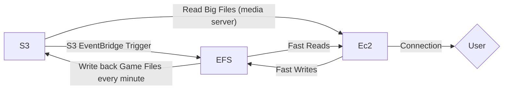

# Nested Stack Components

I broke out the core architecture into [Nested Stacks](https://docs.aws.amazon.com/cdk/api/v2/docs/aws-cdk-lib.NestedStack.html), to keep each "chunk" easy to understand and manage. It was becoming a tangled mess of dependencies, and you'd have no idea what would create a circular import otherwise. All of this is still apart of a single "Stack" (The [Main Stack](../README.md#nestedstacks-leaf-stack-red).)

## Components

### SecurityGroups

Factored this out to avoid circular imports. This NestedStack contains the security groups for the leaf_stack.

### Container

This creates the EC2 Task Definition and Container Definition for the stack.

### Volume

We switched to [AWS S3 Files](https://docs.aws.amazon.com/AmazonS3/latest/userguide/s3-files.html#s3-files-what-is) for our persistent storage, which is basically a vanilla S3 bucket with a EFS cache in front of it. This gives us a cheap bucket for storage and a solid console to work from, along side fast read-writes of the EFS. *This still works with BIG files*, because they naturally [bypass the EFS cache](https://docs.aws.amazon.com/AmazonS3/latest/userguide/s3-files-performance.html#s3-files-performance-how) and go straight to the container.

- How we calculate the User Traffic, by `Ec2.TrafficIn - (S3.BytesDownloaded + EFS.DataReadBytes)`. The traffic into the container from it's volume is also apart of it's traffic in. By removing it, we're left with only traffic from the user. And thus, we can scale down the ASG when not in use.
- Since [EFS uses S3 Notifications to know when to sync](https://docs.aws.amazon.com/AmazonS3/latest/userguide/s3-files-synchronization.html#s3-files-sync-changes-from-bucket) from the S3, there's no "polling metric" you need to subtract from the equation.
- Files stay in EFS for 1 day, and only get [written to S3 when modified, once a minute](https://docs.aws.amazon.com/AmazonS3/latest/userguide/s3-files-performance.html#s3-files-performance-sync). If a bunch of files move to EFS at once, the metric might be negative for one period, I want to keep on eye on this and see how it behaves. Since by default the system only goes down if you're low for 7+ periods, and ignores negatives, it should be fine to get off the ground.

### EcsAsg

This creates the Ecs Cluster/Service, AutoScaling Group, and EC2 Launch Template for the ASG. This is basically the stack for managing the single EC2 instance itself. (ASG is used to simplify management, instead of juggling EC2 directly). It also needs the Efs component to mount it TO the instance itself. (It's also mounted to the container already). The reason is if it's mounted to the instance, you can use SFTP and other tools to access the data directly. No need to duplicate the data to S3 and pay extra costs for storage.

**Volume Mount into Instance**: The S3 Files EFS gets mounted into the instance here. You can use the Ec2 instance that's already running, to SSH in and access/modify/copy the files directly.

**ECS: Ec2 vs Fargate**: (Went with Ec2). Fargate's `awsvpc` takes a couple extra seconds, because it has to attach a ENI card. With using fargate, you have no access to the underlying `ecs.config` file either. Plus Ec2 is cheaper when you're using 100% of the container, you only save money with fargate when it can balloon the CPU/RAM usage. Since our instance is only up when it's actively being used, we're always at/near that %100.

### Watchdog

This monitors the container, and will spin down the ASG if any of it's alarms goes off.

There are three alarms that trigger the scaling down of the ASG:

#### Alarm: Container Activity

This monitors the traffic INTO the container, to detect if it's in use. It also combines it with DNS, so a DNS hit can reset how long we're waiting to spin down. For more info/customization, see [Watchdog.Threshold](../../../Examples/README.md#watchdogthreshold).

#### Alarm: Instance Left Up

This is just to help me sleep at night. If the instance is left up for too long (default 8 hours), it'll send out an SNS alert to check the system. You can also configure it to shut down the instance if this much time has passed. (Default is to just send an alert). For more info/customization, see [Watchdog](../../../Examples/README.md#watchdoginstanceleftup).

#### Alarm: Break Crash Loop

If the task fails to start, or if the container crashes/throws, ECS will normally try to start it again. Even if a circuit-breaker stopped it, you'd still be left with an instance up and no task. (Eventually without traffic, the Container Activity alarm *would* eventually spin it down in this case. You'd still have to wait ~5 minutes for it to trigger though, and be unable to connect.).

This alarm will detect if the container unexpectedly stops for whatever reason, and spins down the ASG. It'll also alert you to check the logs to see what happened. This one has no customization, since I can't think of any customization options that'd be useful.

The reason why we trigger sns off alarm, instead of the event rule directly, is because the rule can be triggered ~4 times before the lambda call finally spins down the ASG. That'd be ~4 emails at once. Also by having an alarm, we can add it to the dashboard for easy monitoring.

**NOTE:** The Mermaid graph shows this triggering by using the `Scale Down ASG Action`. I couldn't figure out how to make the lambda call an existing action, so instead it just spins down the ASG directly with a [boto3 set_desired_capacity](https://boto3.amazonaws.com/v1/documentation/api/latest/reference/services/autoscaling/client/set_desired_capacity.html) call. It's easier to follow the graph if all three "scale down" actions are the same, and it's basically the same logic anyways. (I'm open to a PR if the logic ends up being simple. I think you might have to use a [put_scaling_policy](https://boto3.amazonaws.com/v1/documentation/api/latest/reference/services/autoscaling/client/put_scaling_policy.html)? But idk how to actually trigger an existing one. What would be REALLY nice is if [Events Rule Target](https://docs.aws.amazon.com/cdk/api/v2/docs/aws-cdk-lib.aws_events.IRuleTarget.html) added support for ASG desired count, and we could remove the lambda function all together.)

### AsgStateChangeHook

This component will trigger whenever the ASG instance state changes (i.e the one instance either spins up or down). This is used to keep the architecture simple, plus if you update the instance count in the console, everything will naturally update around it.

### Dashboard

This depends on everything, since it shows metrics for everything. Doesn't really add an extra cost, since it's just a dashboard. Easily see what the entire stack is thinking/doing in one place.
